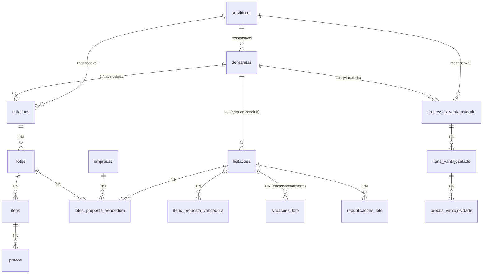
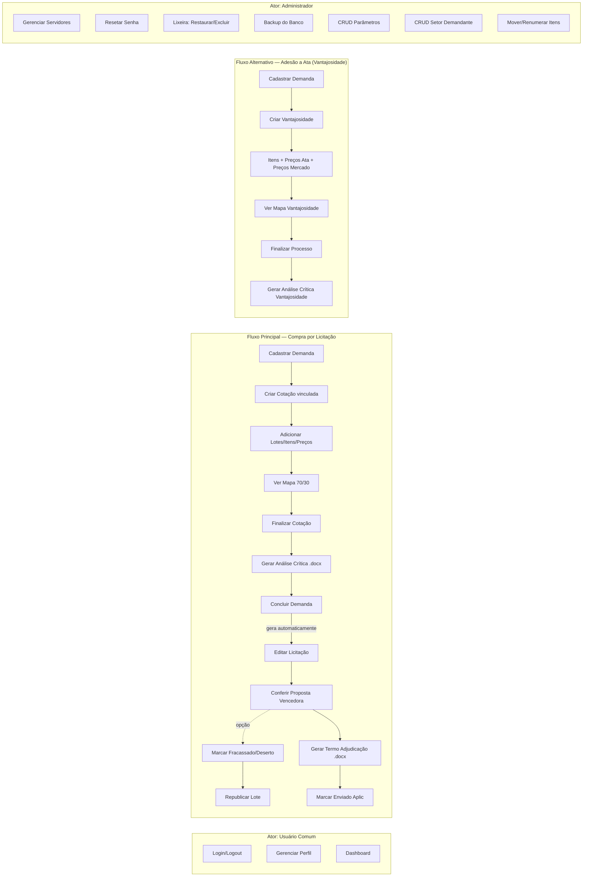
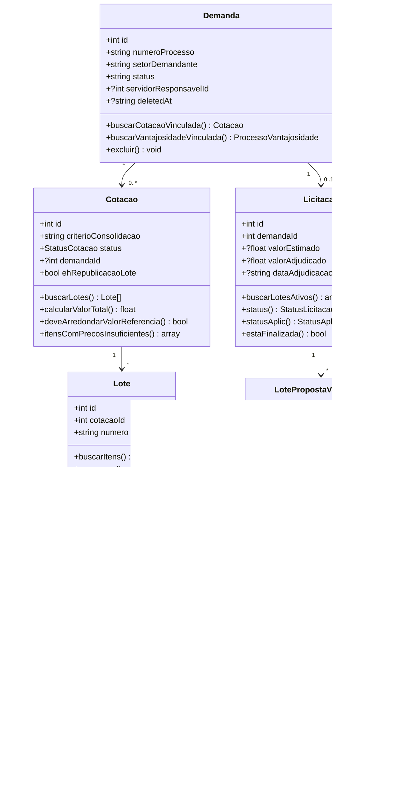
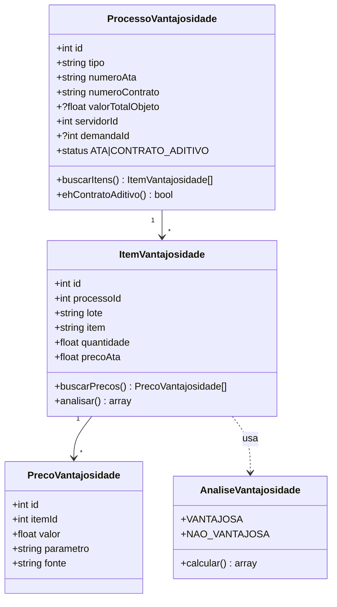
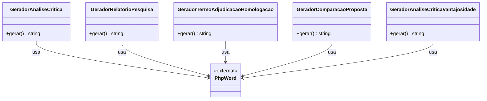
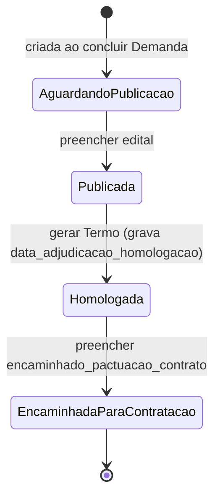
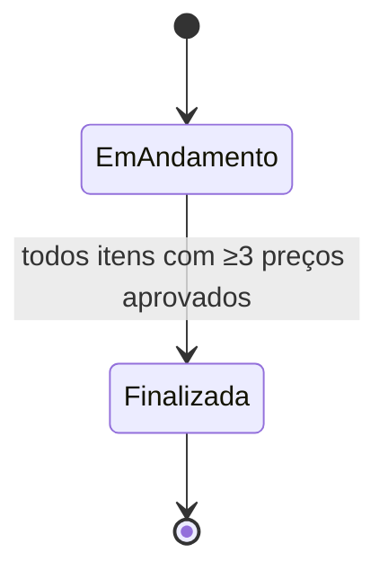
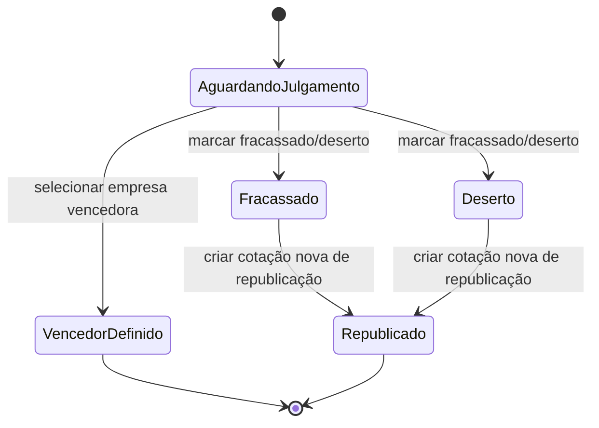

# Auditoria Completa — Sistema MT Par

**Versão do relatório:** 1.0
**Data:** 2026-09-23
**Commit auditado:** `b4d4b4c` (branch `main` / produção)
**Autor:** Auditoria assistida por Claude Code

---

## Sumário

1. [Escopo](#1-escopo)
2. [Arquitetura do Sistema](#2-arquitetura-do-sistema)
3. [Diagrama de Entidades-Relacionamento](#3-diagrama-de-entidades-relacionamento)
4. [Requisitos Funcionais (Casos de Uso)](#4-requisitos-funcionais-casos-de-uso)
    - 4.1 [Autenticação e Perfil](#41-autenticação-e-perfil)
    - 4.2 [Demandas (Processos)](#42-demandas-processos)
    - 4.3 [Cotações (Pesquisa de Preço)](#43-cotações-pesquisa-de-preço)
    - 4.4 [Licitações](#44-licitações)
    - 4.5 [Proposta Vencedora e Documentos](#45-proposta-vencedora-e-documentos)
    - 4.6 [Vantajosidade](#46-vantajosidade)
    - 4.7 [Aplic](#47-aplic)
    - 4.8 [Empresas](#48-empresas)
    - 4.9 [Servidores (Usuários)](#49-servidores-usuários)
    - 4.10 [Cadastros Auxiliares](#410-cadastros-auxiliares)
    - 4.11 [Administração (Lixeira/Backup)](#411-administração-lixeira-e-backup)
    - 4.12 [Relatórios e Dashboard](#412-relatórios-e-dashboard)
5. [Requisitos Não Funcionais](#5-requisitos-não-funcionais)
6. [Regras de Negócio](#6-regras-de-negócio)
7. [Diagrama Geral de Casos de Uso](#7-diagrama-geral-de-casos-de-uso)
8. [Diagramas de Classe](#8-diagramas-de-classe)
9. [Fluxos Detalhados dos Casos de Uso Principais](#9-fluxos-detalhados-dos-casos-de-uso-principais)
10. [Interfaces do Usuário](#10-interfaces-do-usuário)
11. [Situações de Falha, Bugs e Melhorias](#11-situações-de-falha-bugs-e-melhorias-identificadas)

---

## 1. Escopo

O **Sistema MT Par** é um software interno de gestão dos processos de aquisição
da **MT Participações e Projetos S.A.** (órgão público). Automatiza o fluxo
completo entre o recebimento de uma Demanda de compra até a emissão do Termo
de Adjudicação e Homologação da Licitação correspondente, incluindo a
comprovação de vantajosidade quando houver adesão a Ata de Registro de
Preços.

**Público-alvo:**

- Setor de licitações (usuário comum): cadastra demandas, faz pesquisa de
  preços, gera documentos formais.
- Setor demandante: consulta o andamento dos seus processos.
- Administrador do sistema: gerencia servidores, parâmetros, lixeira,
  backup e cadastros auxiliares.

**Contexto operacional:**

- Rede interna do órgão (não é público na Internet).
- Rodando em XAMPP (Apache + PHP 8.2 + SQLite) em máquina local.
- Dois ambientes: **produção** (`C:\xampp\htdocs\mtpar`, branch `main`) e
  **teste** (`C:\xampp\htdocs\mtpar-teste`, branch `dev`).

**Fora de escopo (não faz parte do sistema):**

- Emissão de nota fiscal / gestão contratual pós-homologação.
- Publicação eletrônica em Diário Oficial / SIGADOC (apenas guarda o link).
- Integração com sistemas externos (SICAF, ComprasNet, TCU).
- Emissão de empenho / financeiro.
- Assinatura eletrônica dos documentos (o docx gerado é assinado à parte).

**Métricas do código auditado (commit `b4d4b4c`):**

| Item | Quantidade |
|---|---|
| Rotas em `index.php` | 90 |
| Controllers | 20 |
| Models | 30 |
| Views | 25 |
| Helpers | 7 |
| Tabelas no banco | 19 |
| Testes automatizados (PHPUnit) | 95 |
| Linhas de PHP na aplicação | ~13.800 |

---

## 2. Arquitetura do Sistema

### 2.1 Estilo Arquitetural

**MVC clássico sem framework**, roteamento por `switch/case` no ponto de
entrada único `index.php`. Cada rota resolve para um método de um Controller,
que orquestra Models e monta a View via `require`.

```
Navegador (Bootstrap 5 + JS puro)
        │
        ▼
public/index.php  ── exigirLogin()  ── exigir_csrf()
        │  switch $_GET['action']
        ▼
app/controllers/*.php
        │
        ├─▶ app/models/*.php  ─▶  Database (PDO/SQLite)
        │
        └─▶ app/views/*.php (require)  ─▶  HTML
                │
                └─▶ app/models/Gerador*.php  ─▶  PhpWord → .docx
```

### 2.2 Stack técnica

| Camada | Tecnologia |
|---|---|
| Linguagem servidor | PHP 8.2+ (produção) / PHP 8.4 (sandbox de dev) |
| Banco de dados | SQLite (arquivo `database/mtpar.sqlite`) via PDO |
| Servidor Web | Apache (XAMPP) |
| Front-end CSS | Bootstrap 5.3 + Tabler Icons |
| Front-end JS | JavaScript puro (sem framework) |
| Documentos Word | phpoffice/phpword 1.4 |
| Testes | PHPUnit 11 |
| Dependências | Composer com `platform.php: 8.2.12` travado |

### 2.3 Organização de pastas

```
mtpar/
├── app/
│   ├── controllers/  (20 arquivos, 1 controller por módulo)
│   ├── models/       (30 arquivos, 1 model por entidade + Gerador* p/ docx)
│   ├── views/
│   │   ├── partials/ (header, footer)
│   │   ├── admin/    (telas exclusivas do admin)
│   │   └── *.php     (23 telas)
│   └── helpers/      (auth, csrf, formatacao, extenso, etc.)
├── database/
│   ├── schema.sql    (fonte única de verdade do schema atual)
│   ├── mtpar.sqlite  (banco versionado no Git com dados reais)
│   └── migrate_*.php (histórico, não reexecutar)
├── docs/             (esta documentação)
├── public/           (assets estáticos: css, img, js)
├── tests/            (suíte PHPUnit)
├── vendor/           (Composer; `require-dev` fora do Git)
└── index.php         (roteador + CSRF centralizado)
```

### 2.4 Padrões arquiteturais adotados

- **Roteamento centralizado**: um único `switch` em `index.php`.
- **CSRF centralizado**: `exigir_csrf()` chamado no topo de `index.php`, cobre
  todos os POST/PUT/DELETE.
- **Autenticação por sessão**: `iniciarSessao()` em `helpers/auth.php`;
  `exigirLogin()` e `exigirAdmin()` nos controllers.
- **Enums** (PHP 8.1+) para status: `StatusCotacao`, `StatusLicitacao`,
  `StatusAplic`, `NivelAcesso`.
- **Fonte única de verdade** entre Demanda ↔ Licitação: identidade
  (número do processo, setor, responsável, etc.) mora na Demanda; a
  Licitação relê da Demanda ao carregar (`Licitacao::preencherIdentidadeDaDemanda`).
- **Soft-delete** via coluna `deleted_at` em Demandas, Cotações e
  Processos de Vantajosidade. Lixeira admin permite restauração.
- **Data de corte** para mudança retroativa de comportamento (ex.:
  `Cotacao::DATA_CORTE_VALOR_REFERENCIA_ARREDONDADO = '2026-08-19'`) —
  cotações anteriores mantêm cálculo antigo.

---

## 3. Diagrama de Entidades-Relacionamento

### 3.1 Diagrama (Mermaid ER)



### 3.2 Tabelas — Descrição resumida

| # | Tabela | Papel |
|---|---|---|
| 1 | `servidores` | Usuários do sistema. Guarda credenciais (hash), nível de acesso, matrícula. |
| 2 | `parametros` | Fontes de pesquisa (BPS, Painel de Preços, etc.). Bit `preco_publico` marca fontes que são exceção na análise 70/30. |
| 3 | `setores_demandantes` | Lista mestre para autocomplete (não é FK). |
| 4 | `etapas_processo` | Etapas intermediárias do stepper da tela do Processo. |
| 5 | `demandas` | O "Processo" — a entidade central do fluxo. Soft-delete. |
| 6 | `empresas` | Cadastro por CNPJ único de fornecedores vencedores. |
| 7 | `licitacoes` | Fase de licitação da Demanda. Herda identidade da Demanda. |
| 8 | `cotacoes` | Pesquisa de preço (mapa 70/30). Soft-delete. Flag `eh_republicacao_lote` marca cotação-filha de republicação. |
| 9 | `lotes` | Agrupamento de itens dentro de uma Cotação/Licitação. |
| 10 | `itens` | Item individual do lote (descrição, unidade, quantidade). |
| 11 | `precos` | Preços coletados por item (com fonte/parâmetro). |
| 12 | `itens_proposta_vencedora` | Valor unitário proposto por item na fase de licitação. |
| 13 | `lotes_proposta_vencedora` | Empresa vencedora de cada lote (UNIQUE por licitação+lote). |
| 14 | `situacoes_lote` | Marca um lote específico como FRACASSADO ou DESERTO. |
| 15 | `republicacoes_lote` | Encadeia lote fracassado ↔ cotação nova de republicação. |
| 16 | `processos_vantajosidade` | Análise de vantajosidade para adesão a Ata / contrato aditivo. Soft-delete. |
| 17 | `itens_vantajosidade` | Itens da análise de vantajosidade. |
| 18 | `precos_vantajosidade` | Preços de mercado para comparar com o preço da Ata. |
| 19 | `tentativas_login` | Histórico para rate-limit de login (5 tentativas em 15 min). |

### 3.3 Chaves estrangeiras e cascatas

- `licitacoes.demanda_id → demandas.id` **ON DELETE CASCADE** (excluir
  definitivamente a Demanda apaga a Licitação junto).
- `cotacoes.demanda_id → demandas.id` sem CASCADE de propósito — impede
  excluir a Demanda enquanto houver Cotação vinculada, com mensagem
  amigável no admin (`AdminController::excluirDefinitivamenteDemanda`).
- `lotes → cotacoes`, `itens → lotes`, `precos → itens` — CASCADE encadeado.
- `lotes_proposta_vencedora`, `itens_proposta_vencedora`, `situacoes_lote`
  → `licitacoes` — todas CASCADE.

---

## 4. Requisitos Funcionais (Casos de Uso)

### 4.1 Autenticação e Perfil

Ator principal: **Qualquer usuário** (Servidor cadastrado, nível `COMUM` ou
`ADMIN`). Casos de uso pré-login não têm login como pré-condição — os
demais são citados como requerendo sessão ativa.

**[RF001] Fazer login**

- **Prioridade:** Essencial
- **Ator:** Qualquer usuário
- **Interface(s) associada(s):** `login.php`
- **Entradas / pré-condições:** Servidor previamente cadastrado (com
  usuário e senha definidos). Máximo 5 tentativas nos últimos 15 min por
  usuário.
- **Saídas / pós-condições:**
  - Sucesso: sessão criada, redirecionamento para o Dashboard. Se
    `senha_provisoria = 1`, redireciona para "Definir nova senha".
  - Falha de credencial: mensagem "usuário ou senha inválidos".
  - Rate-limit: bloqueio temporário até janela expirar.

**[RF002] Redefinir senha (fluxo de senha provisória)**

- **Prioridade:** Essencial
- **Ator:** Servidor com `senha_provisoria = 1`
- **Interface(s):** `resetar_senha` (dentro de `login.php`)
- **Entradas / pré-condições:** Sessão iniciada com flag de senha
  provisória.
- **Saídas / pós-condições:** Senha nova gravada, flag zerada, usuário
  segue para o Dashboard.

**[RF003] Logout**

- **Prioridade:** Essencial
- **Ator:** Usuário logado
- **Entradas / pré-condições:** Sessão ativa.
- **Saídas / pós-condições:** Sessão destruída, redireciona para login.

**[RF004] Atualizar perfil**

- **Prioridade:** Importante
- **Ator:** Usuário logado
- **Interface(s):** `perfil.php`
- **Entradas / pré-condições:** Sessão ativa. CSRF token.
- **Saídas / pós-condições:** Nome, matrícula, cargo, senha atualizados
  para o próprio servidor.

---

### 4.2 Demandas (Processos)

Ator padrão: **Usuário logado (COMUM ou ADMIN)**. A Demanda é o "Processo"
— entidade central de todo o fluxo.

**[RF001] Listar Demandas ativas**

- **Prioridade:** Essencial
- **Interface(s):** `demandas.php`
- **Entradas / pré-condições:** Login. Só lista demandas com
  `deleted_at IS NULL`.
- **Saídas / pós-condições:** Tabela com todas as demandas, chips de
  status, busca por número do processo.

**[RF002] Criar Demanda**

- **Prioridade:** Essencial
- **Interface(s):** Modal em `demandas.php`
- **Entradas / pré-condições:** Número do processo e data de recebimento
  obrigatórios. Setor demandante, objeto e servidor responsável opcionais.
- **Saídas / pós-condições:** Demanda gravada, redireciona para tela do
  Processo. **Trava (paliativa ainda não em produção):** impedir dois
  processos com mesmo número — hoje em `dev`, ver seção 11.

**[RF003] Visualizar / Editar Demanda (tela do Processo)**

- **Prioridade:** Essencial
- **Interface(s):** `demanda_detalhe.php`
- **Entradas / pré-condições:** ID da Demanda. Aceita `origem` (`licitacoes`,
  `cotacao`) para o botão "Voltar" contextual.
- **Saídas / pós-condições:** Tela com stepper, dados do processo,
  cotação/vantajosidade vinculada, licitação (se concluído) e ações.

**[RF004] Editar Demanda inline**

- **Prioridade:** Essencial
- **Interface(s):** Modal em `demanda_detalhe.php`
- **Entradas / pré-condições:** ID da Demanda, novos dados. Número não
  pode colidir com outro processo ativo (validação em `dev` ainda).
- **Saídas / pós-condições:** Demanda atualizada. Se status mudou para
  `CONCLUÍDO`, dispara `Licitacao::gerarAoConcluirDemanda` (só para
  processos que vão à licitação — vantajosidade fica de fora).

**[RF005] Excluir Demanda (soft-delete)**

- **Prioridade:** Essencial
- **Interface(s):** Botão em `demanda_detalhe.php` / `demandas.php`
- **Entradas / pré-condições:** ID válido. CSRF.
- **Saídas / pós-condições:** `deleted_at = agora()`. Volta para
  `demandas.php`. Demanda desaparece de listagens ativas mas continua no
  banco. **Bug conhecido em produção**: licitação vinculada continua
  aparecendo na tela `/licitacoes` (falta o `INNER JOIN demandas WHERE
  deleted_at IS NULL` — corrigido em `dev`, ver seção 11).

---

### 4.3 Cotações (Pesquisa de Preço)

Ator: **Usuário logado**. Cotação = pesquisa de preço com análise 70/30
(critérios de Excessivo e Inexequível).

**[RF001] Listar Cotações**

- **Prioridade:** Essencial
- **Interface(s):** `cotacoes.php`
- **Entradas / pré-condições:** Login. Filtra `deleted_at IS NULL` e
  `eh_republicacao_lote = 0`.
- **Saídas / pós-condições:** Chips por status, busca, botão "Nova
  cotação".

**[RF002] Criar Cotação (assistente com Demanda existente)**

- **Prioridade:** Essencial
- **Entradas / pré-condições:** Vincular a uma Demanda existente sem
  cotação. Número do processo e servidor responsável obrigatórios.
- **Saídas / pós-condições:** Cotação criada com status `EM_ANDAMENTO`.

**[RF003] Criar Cotação com Demanda nova**

- **Prioridade:** Essencial
- **Entradas / pré-condições:** Cria Demanda e Cotação de uma vez.
- **Saídas / pós-condições:** Demanda + Cotação vinculadas.

**[RF004] Criar Cotação a partir da Demanda (atalho)**

- **Prioridade:** Importante
- **Interface(s):** `cotacao_nova_para_demanda.php`
- **Entradas / pré-condições:** Acessado de dentro da tela do Processo.
  Bypassa o assistente de 3 modais.

**[RF005] Editar dados da Cotação**

- **Prioridade:** Importante
- **Entradas / pré-condições:** Cotação existente. Modal em `cotacao.php`.

**[RF006] Adicionar / Editar / Excluir Lotes, Itens e Preços**

- **Prioridade:** Essencial
- **Interface(s):** `cotacao.php` (tabelas expansíveis)
- **Entradas / pré-condições:** Cotação `EM_ANDAMENTO` (finalizada
  também aceita edição via admin, ver melhorias).
- **Saídas / pós-condições:** Preço passa por `converterMoedaBrParaFloat`
  (helper); análise 70/30 é recalculada em tempo real.

**[RF007] Mover Item de lote (admin)**

- **Prioridade:** Desejável
- **Ator:** Administrador
- **Entradas / pré-condições:** Item existente. Lote de destino da mesma
  Cotação, ou "criar novo lote".
- **Saídas / pós-condições:** Item reatribuído sem perder preços. Ambos
  os lotes têm itens renumerados sequencialmente (corrige numeração
  torta acumulada).

**[RF008] Renumerar itens de um lote (admin)**

- **Prioridade:** Desejável
- **Ator:** Administrador
- **Entradas / pré-condições:** Lote com numeração torta.
- **Saídas / pós-condições:** Itens renumerados 1,2,3… sem mudar ordem.

**[RF009] Ver Mapa Comparativo de Preços**

- **Prioridade:** Essencial
- **Interface(s):** `mapa.php`
- **Entradas / pré-condições:** Cotação com preços cadastrados.
- **Saídas / pós-condições:** Tabela com todas as fontes por item, valor
  de referência (média/mediana/menor preço), total do item e do lote,
  valor global da cotação. Botão "Imprimir/PDF".

**[RF010] Ver Validação do Preço de Referência**

- **Prioridade:** Essencial
- **Interface(s):** `validacao_preco_referencia.php`
- **Entradas / pré-condições:** Cotação `FINALIZADA`.
- **Saídas / pós-condições:** Mesma tabela do mapa sem colunas de fonte
  (só item, especificação, critério, und, qtd, total).

**[RF011] Finalizar Cotação**

- **Prioridade:** Essencial
- **Entradas / pré-condições:** Todos os itens têm ≥ 3 preços aprovados
  ao final da Etapa 2 (`MINIMO_PRECOS_APROVADOS_ETAPA2`). Planilha
  Orçamentária é exceção.
- **Saídas / pós-condições:** Status vai para `FINALIZADA`.

**[RF012] Gerar Análise Crítica (docx)**

- **Prioridade:** Essencial
- **Interface(s):** `relatorio_formulario.php`
- **Entradas / pré-condições:** Cotação `FINALIZADA` e não Planilha
  Orçamentária. Elaborado por + validador definidos, número DFD.
- **Saídas / pós-condições:** Download `.docx` gerado por PhpWord.

**[RF013] Gerar Relatório Pesquisa (docx)**

- **Prioridade:** Importante
- **Entradas / pré-condições:** Cotação `FINALIZADA`.
- **Saídas / pós-condições:** `.docx` com todas as tabelas de análise.

**[RF014] Excluir Cotação (soft-delete)**

- **Prioridade:** Essencial
- **Saídas / pós-condições:** Cotação vai para a lixeira do admin.

---

### 4.4 Licitações

Ator: **Usuário logado**. Licitações são geradas automaticamente ao
concluir uma Demanda (exceto Vantajosidade). Herdam identidade da Demanda.

**[RF001] Listar Licitações**

- **Prioridade:** Essencial
- **Interface(s):** `licitacoes.php`
- **Saídas / pós-condições:** Chips por status (Aguardando publicação,
  Publicada, Homologada, Encaminhada). Busca por número. **Bug em
  produção**: mostra licitação de Demanda excluída (ver seção 11).

**[RF002] Ver Licitação (via tela do Processo)**

- **Prioridade:** Essencial
- **Interface(s):** Card na `demanda_detalhe.php`
- **Saídas / pós-condições:** Mostra edital, sessão pública, valor
  estimado, valor adjudicado, status Aplic, data de homologação.

**[RF003] Editar Licitação**

- **Prioridade:** Essencial
- **Entradas / pré-condições:** Campos editáveis: edital, realização da
  sessão, valor adjudicado, encaminhamento para contratação. Servidor
  responsável só é editado na Demanda (fonte única).
- **Saídas / pós-condições:** Licitação atualizada.

**[RF004] Excluir Licitação**

- **Prioridade:** Importante
- **Saídas / pós-condições:** Registro removido (não é soft-delete;
  CASCADE de `lotes_proposta_vencedora` etc.).

---

### 4.5 Proposta Vencedora e Documentos

Ator: **Usuário logado**. Depois que a Demanda gera Licitação, o setor
confere a proposta e emite os documentos oficiais.

**[RF001] Conferir Proposta Vencedora**

- **Prioridade:** Essencial
- **Interface(s):** `proposta_vencedora.php`
- **Entradas / pré-condições:** Licitação existente, Cotação vinculada.
- **Saídas / pós-condições:** Tela por lote com widget de seleção de
  empresa (busca + cadastro inline) e tabela de valores propostos por
  item. Cálculos em JS em tempo real.

**[RF002] Cadastrar Empresa nova durante conferência**

- **Prioridade:** Essencial
- **Entradas / pré-condições:** CNPJ válido (14 dígitos). Nome obrigatório
  se CNPJ é novo.
- **Saídas / pós-condições:**
  - CNPJ novo → cria e seleciona.
  - CNPJ existente → **retorna a empresa existente e seleciona** (fix do
    commit `913f40d`).
- **Bug corrigido em `b4d4b4c`**: AJAX não enviava CSRF token, retornava
  403 silencioso.

**[RF003] Marcar lote como FRACASSADO ou DESERTO**

- **Prioridade:** Essencial
- **Entradas / pré-condições:** Motivo obrigatório. Modal em
  `proposta_vencedora.php`. Opção "republicar agora" já cria a
  cotação-filha.
- **Saídas / pós-condições:** `situacoes_lote` gravada. Se
  `republicar_agora`, cria Cotação de republicação com `-R2`, `-R3`, etc.

**[RF004] Republicar lote (posterior)**

- **Prioridade:** Essencial
- **Entradas / pré-condições:** Lote com `SituacaoLote` gravada mas sem
  republicação criada ainda.
- **Saídas / pós-condições:** Cria Cotação nova (com
  `eh_republicacao_lote = 1`), lote novo, e registro em
  `republicacoes_lote`.

**[RF005] Gerar Comparação Proposta vs Referência (docx)**

- **Prioridade:** Essencial
- **Entradas / pré-condições:** Ao menos um lote com proposta preenchida.
- **Saídas / pós-condições:** Download `.docx` com tabela por lote,
  situação (Dentro do valor / Acima da referência), subtotal e total.

**[RF006] Gerar Termo de Adjudicação/Homologação (docx)**

- **Prioridade:** Essencial
- **Entradas / pré-condições:** Todos os lotes ativos precisam ter
  RESOLUÇÃO (empresa vencedora OU FRACASSADO/DESERTO). Data selecionada.
- **Saídas / pós-condições:** Grava `data_adjudicacao_homologacao` (só se
  ainda não estava gravada) e faz download do `.docx`. A Licitação
  passa a `Homologada`.

---

### 4.6 Vantajosidade

Ator: **Usuário logado**. Para adesão a Ata de Registro de Preços ou
aditivo de contrato — não gera Licitação, gera análise de vantajosidade.

**[RF001] Listar Processos de Vantajosidade**

- **Prioridade:** Essencial
- **Interface(s):** `vantajosidade_lista.php`

**[RF002] Criar Processo (com Demanda existente / nova / atalho)**

- **Prioridade:** Essencial
- **Entradas / pré-condições:** Tipo `ATA` (número da Ata obrigatório) ou
  `CONTRATO_ADITIVO` (número do contrato + valor total obrigatórios).

**[RF003] Adicionar Itens / Preços de mercado**

- **Prioridade:** Essencial
- **Entradas / pré-condições:** `preco_ata` obrigatório (preço da Ata). Ao
  menos um preço de mercado por item para a análise ficar completa.

**[RF004] Ver Mapa de Vantajosidade**

- **Prioridade:** Essencial
- **Interface(s):** `vantajosidade_mapa.php`
- **Saídas / pós-condições:** Análise `AnaliseVantajosidade` classifica
  cada item como VANTAJOSA ou NÃO VANTAJOSA.

**[RF005] Finalizar Processo de Vantajosidade**

- **Prioridade:** Essencial
- **Saídas / pós-condições:** Status vai para `FINALIZADO`.

**[RF006] Gerar Análise Crítica de Vantajosidade (docx)**

- **Prioridade:** Essencial
- **Entradas / pré-condições:** Processo `FINALIZADO`.

**[RF007] Aditivo de contrato (regra específica)**

- **Prioridade:** Essencial
- **Regra:** limite legal do aditivo é 25% (`LIMITE_LEGAL_ADITIVO_PERCENTUAL`).

**[RF008] Excluir Vantajosidade (soft-delete)**

- **Prioridade:** Importante

---

### 4.7 Aplic

Ator: **Usuário logado**. Aplic = fluxo de envio do processo para o
sistema externo (informação de estado, não integração real).

**[RF001] Painel Aplic**

- **Prioridade:** Essencial
- **Interface(s):** `painel_aplic.php`
- **Saídas / pós-condições:** Lista licitações homologadas com status
  Aplic (Não aplicável / Pendente / Enviado).

**[RF002] Marcar como Enviado**

- **Prioridade:** Essencial
- **Entradas / pré-condições:** Licitação homologada.
- **Saídas / pós-condições:** Grava `enviado_aplic_em = agora()`.

**[RF003] Desmarcar Envio**

- **Prioridade:** Importante
- **Saídas / pós-condições:** Zera `enviado_aplic_em`.

---

### 4.8 Empresas

Ator: **Usuário logado** (cadastro rápido); **Administrador** (edição
completa não implementada — hoje só via banco).

**[RF001] Buscar empresa (autocomplete AJAX)**

- **Prioridade:** Essencial
- **Interface(s):** Widget em `proposta_vencedora.php`
- **Entradas / pré-condições:** Query de 2+ caracteres.
- **Saídas / pós-condições:** JSON com nome, fantasia, CNPJ formatado,
  número de licitações homologadas.

**[RF002] Cadastrar Empresa (via widget)**

- **Prioridade:** Essencial
- **Regra:** CNPJ único (`empresas.cnpj UNIQUE`). Se já existir, retorna
  a existente (paliativo, ver seção 11).

---

### 4.9 Servidores (Usuários)

Ator: **Administrador**.

**[RF001] Listar Servidores**

- **Prioridade:** Essencial
- **Interface(s):** `servidores.php`

**[RF002] Cadastrar Servidor**

- **Prioridade:** Essencial
- **Regra:** Senha provisória = 1 no cadastro, forçando redefinição no
  primeiro login.

**[RF003] Editar Servidor**

- **Prioridade:** Essencial

**[RF004] Resetar Senha de Servidor**

- **Prioridade:** Essencial
- **Saídas / pós-condições:** Senha vira "12345" e flag provisória = 1.

**[RF005] Excluir Servidor**

- **Prioridade:** Importante

---

### 4.10 Cadastros auxiliares

Ator: **Administrador** para gerenciar; **usuário logado** para consumir.

**[RF001] CRUD Setor Demandante**
- **Prioridade:** Importante
- **Interface(s):** `setores_demandantes` (via menu admin)
- Alimenta autocomplete/select nos formulários de Demanda.

**[RF002] CRUD Parâmetros de pesquisa**
- **Prioridade:** Essencial
- **Interface(s):** `parametros.php`
- Fontes (BPS, Painel de Preços, etc.) usadas no widget de preços. Flag
  `preco_publico` marca fontes de exceção na análise 70/30.

---

### 4.11 Administração (Lixeira e Backup)

Ator: **Administrador**. Todas as ações passam por `exigirAdmin()`.

**[RF001] Painel Admin**
- **Prioridade:** Essencial
- **Interface(s):** `admin/index.php`

**[RF002] Ver Lixeira (Demandas / Cotações / Vantajosidades excluídas)**
- **Prioridade:** Essencial
- **Interface(s):** `admin/lixeira.php`

**[RF003] Restaurar item da lixeira**
- **Prioridade:** Essencial
- Zera `deleted_at`.

**[RF004] Excluir definitivamente**
- **Prioridade:** Importante
- **Regra:** Demanda com Cotação vinculada dispara mensagem amigável
  (não fica erro fatal — a FK sem CASCADE em `cotacoes.demanda_id`
  bate primeiro).

**[RF005] Criar backup manual**
- **Prioridade:** Essencial
- **Saídas / pós-condições:** Cópia do `.sqlite` para pasta de backups
  local com timestamp.

**[RF006] Excluir backup**
- **Prioridade:** Desejável

---

### 4.12 Relatórios e Dashboard

Ator: **Usuário logado**.

**[RF001] Dashboard**
- **Prioridade:** Essencial
- **Interface(s):** `dashboard.php`
- Cards com contagem de Demandas em andamento, Licitações publicadas,
  homologadas, total adjudicado, pendências Aplic, minhas demandas.

**[RF002] Menu Orçamentos (hub)**
- **Prioridade:** Importante
- **Interface(s):** `orcamentos.php`
- Duas rotas: "Pesquisa de preço" (→ Cotações) e "Comprovação de
  vantajosidade" (→ Vantajosidades).

**[RF003] Relatórios de Licitação**
- **Prioridade:** Importante
- **Interface(s):** `relatorios_licitacao.php`
- Agrupa licitações homologadas por setor/período/modalidade para
  análise gerencial.

---

## 5. Requisitos Não Funcionais

### 5.1 Usabilidade

**[NF001] Interface responsiva e consistente**
- Usa Bootstrap 5.3 com componentes padronizados (chips, badges, modals).
- **Prioridade:** Essencial

**[NF002] Comunicação de erros clara para leigos**
- Mensagens em português, sem stack trace, com sugestão de próximo passo.
- **Prioridade:** Essencial

**[NF003] Formulários pré-preenchidos**
- Formatação BR de moeda (R$ 1.234,56) e datas (dd/mm/yyyy) na exibição;
  parser aceita ambas as formas na entrada.
- **Prioridade:** Essencial

**[NF004] Navegação contextual "Voltar"**
- Query string `origem` faz o botão "Voltar" levar de volta pra tela de
  origem (Cotação → Demanda → Cotação).
- **Prioridade:** Importante

### 5.2 Confiabilidade

**[NF001] Soft-delete padronizado**
- Demandas, Cotações e Vantajosidades usam `deleted_at`. Admin restaura
  ou exclui definitivamente.
- **Prioridade:** Essencial

**[NF002] Testes automatizados (PHPUnit)**
- 95 testes cobrindo models e helpers. `composer test` roda a suíte.
- **Prioridade:** Essencial

**[NF003] Preservação de valores históricos**
- Cotações criadas antes da data de corte
  (`DATA_CORTE_VALOR_REFERENCIA_ARREDONDADO = 2026-08-19`) mantêm cálculo
  antigo do valor de referência para não alterar Mapas/Relatórios já
  emitidos.
- **Prioridade:** Essencial

**[NF004] Rate-limit de login**
- 5 tentativas em 15 min por usuário evita força bruta.
- **Prioridade:** Essencial

**[NF005] Backup manual do banco**
- Admin cria snapshot do `.sqlite` com um clique.
- **Prioridade:** Importante

### 5.3 Desempenho

**[NF001] Fim do N+1 nas listagens**
- `Servidor::mapaPorIds`, `Cotacao::mapaPorDemandaIds`,
  `ProcessoVantajosidade::mapaPorDemandaIds` evitam consultas por linha.
- **Prioridade:** Essencial
- **Casos de uso associados:** RF002 Demandas, RF001 Licitações.

**[NF002] Cálculo de mapa não resincroniza em listagens**
- `Licitacao::fromArray` aceita flag `sincronizar: false` para evitar
  recomputar preços em `buscarTodas`.
- **Prioridade:** Importante

**[NF003] JS de cálculo em tempo real na Conferência**
- Debounce em input de proposta, recalcula subtotais sem round-trip.
- **Prioridade:** Importante

### 5.4 Segurança

**[NF001] CSRF centralizado**
- Token em sessão, verificado em `index.php` para todo POST/PUT/DELETE.
- **Prioridade:** Essencial

**[NF002] Senha com hash bcrypt**
- `password_hash(PASSWORD_BCRYPT)` para senhas.
- **Prioridade:** Essencial

**[NF003] Autorização por nível**
- `exigirLogin()` e `exigirAdmin()` guardam rotas sensíveis.
- **Prioridade:** Essencial

**[NF004] Prepared statements em todas as queries**
- Todas as queries usam `PDO::prepare` com binding — nenhuma concatenação
  direta.
- **Prioridade:** Essencial

**[NF005] Uso interno em rede local**
- Sistema não é público. Firewall / VPN são responsabilidade da rede.
- **Prioridade:** Essencial

### 5.5 Distribuição

**[NF001] Deploy por `git pull`**
- Produção não roda `composer install`. `vendor/` é versionado (dev-deps
  fora via `.gitignore`).
- **Prioridade:** Essencial

**[NF002] Sem CI/CD automatizado**
- Testes são a única rede automatizada; deploy é manual (`git pull`).
- **Prioridade:** Importante

### 5.6 Padrões

**[NF001] PSR-4 / autoload Composer**
- `require_once` explícito em cada controller (histórico do projeto), mas
  `vendor/autoload.php` é usado para PhpWord.
- **Prioridade:** Importante

**[NF002] PHP 8.2+ (com PHP 8.1+ features)**
- Enums, readonly, promoção de construtor, tipagem estrita.
- **Prioridade:** Essencial

### 5.7 Hardware e software

**[NF001] XAMPP com PHP 8.2.12**
- Produção roda essa versão exata. `composer.json` trava para evitar
  divergência.
- **Prioridade:** Essencial

**[NF002] Extensão PHP `zip` ativa**
- PhpWord depende de `ZipArchive`. Sem a extensão, gerar qualquer `.docx`
  quebra com "Fatal error: Class ZipArchive not found".
- **Prioridade:** Essencial

**[NF003] Máquina local em rede interna**
- Sem cloud, sem load balancer. Backup manual.
- **Prioridade:** Essencial

---

## 6. Regras de Negócio

**RN001 — Análise 70/30 (art. 47 do Decreto Estadual 1.525/2022)**

Cada preço é analisado em duas etapas:
- **Etapa 1 — Excessivo:** se `preço > média_dos_outros × 1.30`, é
  descartado (EXCESSIVAMENTE ELEVADO).
- **Etapa 2 — Inexequível:** dos que sobraram, se `preço < média × 0.70`,
  é descartado (INEXEQUÍVEL). Exceção: se o parâmetro é "preço público"
  (BPS, Painel de Preços, etc. — marcado em `parametros.preco_publico`),
  o preço nunca cai em inexequível (`EXCEÇÃO – PREÇO PÚBLICO`).

**RN002 — Mínimo de 3 preços aprovados para finalizar cotação**

`Cotacao::MINIMO_PRECOS_APROVADOS_ETAPA2 = 3` — art. 9º §2º RILC/MTPAR.
Exceção: critério `PLANILHA_ORCAMENTARIA` (valor único digitado, sem
comparação) ignora essa regra.

**RN003 — Critérios de consolidação do valor de referência**

- `MEDIA` — média aritmética simples dos aprovados.
- `MEDIANA` — mediana (padrão).
- `MENOR_PRECO` — menor entre os aprovados.
- `PLANILHA_ORCAMENTARIA` — valor único, sem análise comparativa.

**RN004 — Arredondamento do valor de referência a partir da data de corte**

Cotações criadas a partir de **2026-08-19** têm o valor de referência
arredondado para centavos na origem (`round($v, 2)`). Anteriores mantêm
o cálculo bruto para não alterar Mapas/Termos já emitidos. Ver seção 11
para o refinamento aplicado em `main` (`5f37535`).

**RN005 — Fonte única de verdade Demanda ↔ Licitação**

Identidade (número, setor, servidor, objeto, data recebimento) mora na
Demanda. Licitação relê da Demanda ao ser carregada
(`Licitacao::preencherIdentidadeDaDemanda`). Editar a Demanda propaga
para a Licitação automaticamente.

**RN006 — Geração de Licitação ao concluir Demanda**

Demanda com status `CONCLUÍDO` dispara `Licitacao::gerarAoConcluirDemanda`,
que cria uma Licitação com valor estimado herdado da Cotação vinculada.
Demandas de Vantajosidade **não** geram Licitação.

**RN007 — Resolução de lotes para gerar Termo**

Todos os lotes ativos precisam de RESOLUÇÃO antes de emitir o Termo:
- OU tem `LotePropostaVencedora` (empresa vencedora), OU
- Tem `SituacaoLote` marcada (FRACASSADO / DESERTO).

**RN008 — Republicação de lote fracassado/deserto**

Cria uma Cotação-filha com `eh_republicacao_lote = 1` (invisível na
listagem geral) e número `NNN-R2`, `NNN-R3`, etc. `RepublicacaoLote`
encadeia lote antigo ↔ lote novo ↔ cotação nova.

**RN009 — Homologação = geração do Termo**

Gerar o Termo é o ato que ENCERRA a licitação
(`data_adjudicacao_homologacao` gravada). Não existe botão "finalizar
processo" separado — foi absorvido pelo fluxo de gerar termo.

**RN010 — Aplic**

Só faz sentido depois de homologada. Estado inicial: Pendente. Vai para
Enviado só com o clique de "Marcar como enviado" (não é integração
automática).

**RN011 — Aditivo de contrato: limite 25%**

`ProcessoVantajosidade::LIMITE_LEGAL_ADITIVO_PERCENTUAL = 25.0`. O
sistema alerta se o percentual do aditivo ultrapassar esse teto.

**RN012 — Vantajosidade: análise por item**

Cada item é VANTAJOSA se o preço médio de mercado for maior que o preço
da Ata (ou seja, a Ata compensa) — caso contrário NÃO VANTAJOSA.

**RN013 — Demanda na lixeira permite recadastrar número**

`existeOutraComNumero` (em `dev`) ignora demandas na lixeira. Se o setor
excluir um número por engano, dá pra recadastrar o mesmo número sem
restaurar/limpar a lixeira.

**RN014 — CNPJ único para empresas**

Constraint `UNIQUE (cnpj)`. Paliativo em `main` (`913f40d`): tentativa de
cadastrar CNPJ existente devolve a empresa cadastrada em vez de recusar.

**RN015 — Rate-limit de login**

5 tentativas erradas em 15 min por usuário → bloqueio até a janela
expirar.

**RN016 — Senha provisória força redefinição**

Todo servidor novo tem `senha_provisoria = 1`. Primeiro login exige
definir nova senha.

---

## 7. Diagrama Geral de Casos de Uso



---

## 8. Diagramas de Classe

### 8.1 Modelo do domínio principal



### 8.2 Modelo de Vantajosidade



### 8.3 Geradores de documento (docx)



---

## 9. Fluxos Detalhados dos Casos de Uso Principais

### 9.1 Fluxo — Cotação: da criação ao Termo de Adjudicação

**Fluxo principal:**

1. Usuário cria Demanda (`POST criar_demanda`).
2. Usuário abre a Demanda e clica "Nova pesquisa de preço".
3. Sistema cria Cotação vinculada e leva para `cotacao.php`.
4. Usuário cria Lote → adiciona Item(s) → adiciona Preços por item.
5. Sistema, em cada preço:
   - Etapa 1 (excessivo): se `preco / mediaOutros > 1.30`, marca EXCESSIVO.
   - Etapa 2 (inexequível): se `preco / mediaOutros < 0.70`, marca
     INEXEQUÍVEL, salvo se parâmetro for preço público.
6. Usuário abre "Mapa Comparativo" e revisa.
7. Usuário clica "Finalizar cotação":
   - Sistema checa se cada item tem ≥ 3 preços aprovados.
   - Se falta, mensagem detalhada por item pendente.
   - Se ok, status vai para FINALIZADA.
8. Usuário gera Análise Crítica (docx) para o processo administrativo.
9. Usuário volta na tela do Processo e conclui a Demanda.
10. Sistema gera Licitação com valor estimado herdado da Cotação.
11. Usuário edita Licitação (edital, data da sessão) conforme o processo
    avança.
12. Usuário abre "Conferir Proposta Vencedora":
    - Por lote, seleciona/cadastra empresa e digita valor proposto por
      item.
    - JS calcula subtotal e economicidade em tempo real.
    - Alternativamente, marca lote como FRACASSADO/DESERTO (com opção
      de republicar imediatamente).
13. Depois que todos os lotes têm resolução, gera "Termo de Adjudicação
    e Homologação" (docx). Sistema grava data de homologação e a
    Licitação passa para status Homologada.
14. Usuário abre Painel Aplic e marca a Licitação como enviada.

**Fluxos secundários:**

- **F.S. Republicação:** entre 12 e 13, um lote pode ser marcado como
  fracassado. Se optar por republicar, sistema cria Cotação-filha com
  sufixo `-R2`. Usuário refaz pesquisa de preços daquele lote específico.
- **F.S. Item sem propostas suficientes:** ao tentar finalizar cotação,
  sistema lista os itens pendentes com quantidade de preços aprovados
  vs. mínimo.
- **F.S. Trocar empresa vencedora:** paliativo ativo em `main` — se o
  CNPJ digitado já existe no banco, o cadastro devolve a empresa
  existente e a seleciona no lote.
- **F.S. Excluir Demanda (soft-delete):** vai para lixeira, admin pode
  restaurar. Licitação vinculada continua no banco por ora (bug já
  corrigido em `dev`, ainda não em `main`).

### 9.2 Fluxo — Vantajosidade (adesão a Ata)

**Fluxo principal:**

1. Usuário cria Demanda.
2. Cria Processo de Vantajosidade tipo ATA (com número da Ata).
3. Adiciona itens com `preco_ata` obrigatório.
4. Adiciona preços de mercado para cada item (fontes diversas).
5. Mapa de Vantajosidade classifica cada item como VANTAJOSA ou NÃO
   VANTAJOSA.
6. Finaliza o processo.
7. Gera Análise Crítica de Vantajosidade (docx).

**Fluxo secundário: contrato aditivo**

- Tipo `CONTRATO_ADITIVO`: em vez de número da Ata, exige número do
  contrato + valor total do objeto. Sistema alerta se o aditivo passa
  de 25%.

### 9.3 Diagrama de estado — Licitação



### 9.4 Diagrama de estado — Cotação



### 9.5 Diagrama de estado — Lote na Conferência de Proposta



---

## 10. Interfaces do Usuário

### I01 — Login (`login.php`)

Formulário centralizado com logo. Campos: usuário, senha. Botão "Entrar".
Mensagem de erro embaixo. Fluxo de senha provisória substitui os campos
por "senha atual" + "nova senha" + "confirmação".

### I02 — Dashboard (`dashboard.php`)

Cards com contagens: Demandas em andamento, Licitações publicadas,
Homologadas, Total adjudicado, Pendências Aplic, Minhas demandas.

### I03 — Lista de Demandas (`demandas.php`)

Chips por status no topo. Tabela com número, setor, objeto, servidor,
status, ações. Botão "Nova demanda" abre modal.

### I04 — Tela do Processo (`demanda_detalhe.php`)

Stepper visual do andamento. Cards com dados da Demanda, Cotação/
Vantajosidade vinculada, Licitação. Botões contextuais (Nova pesquisa,
Ver mapa, Gerar Termo). Botão "Voltar" contextual.

### I05 — Lista de Cotações (`cotacoes.php`)

Chips + tabela. Busca. Assistente de 3 modais para nova cotação.

### I06 — Tela da Cotação (`cotacao.php`)

Cards por lote com tabela de itens (expansível). Cada item mostra
preços coletados, análise 70/30, valor de referência, total. Formulários
inline para adicionar/editar preços.

### I07 — Mapa Comparativo (`mapa.php`)

Tabela larga com fontes de preço em colunas, itens em linhas, subtotais
por lote, valor global. Modo impressão.

### I08 — Validação do Preço de Referência (`validacao_preco_referencia.php`)

Mesma tabela do Mapa sem colunas de fonte.

### I09 — Lista de Licitações (`licitacoes.php`)

Chips por status. Tabela com número, setor, objeto, servidor, edital,
valor estimado, valor adjudicado, status Aplic.

### I10 — Conferência de Proposta Vencedora (`proposta_vencedora.php`)

Card sticky com Resumo (Estimado, Proposto, Economicidade, botões
Salvar/Gerar). Um card por lote com widget de empresa (busca +
cadastro) e tabela de itens com input de proposta unitária.
Recomputa em JS.

### I11 — Vantajosidade — Lista, Tela e Mapa

Similar à Cotação, mas com `preco_ata` na tabela e classificação
Vantajosa/Não Vantajosa.

### I12 — Painel Admin (`admin/index.php`)

Cards de acesso rápido: Servidores, Setores, Parâmetros, Lixeira,
Backup.

### I13 — Painel Aplic (`painel_aplic.php`)

Lista licitações homologadas com botão "Marcar como enviado" e chip
de estado.

### I14 — Perfil (`perfil.php`)

Formulário do próprio servidor: nome, matrícula, cargo, trocar senha.

---

## 11. Situações de Falha, Bugs e Melhorias Identificadas

### 11.1 Bugs corrigidos nesta auditoria (branch `main`)

| # | Commit | Descrição |
|---|---|---|
| 1 | `639f854` | **Soma dos orçamentos com centavo fantasma no Mapa/Cotação/Termo.** Item total (`valor_ref × qtd`) era somado bruto no total do lote, mas exibido arredondado. Conferência manual não batia. Round por item antes de somar. |
| 2 | `5f37535` | **Refinamento do fix acima:** cotações antigas (antes de 2026-08-19) mantinham `valor_referencia` bruto (ex.: 1031,6666…) e mesmo somando totais arredondados o `qtd × ref` no display errava 1 centavo. Passa a arredondar a referência antes de multiplicar em todo ponto de EXIBIÇÃO/SOMA. |
| 3 | `1a579e5` | **Tela de Conferência de Proposta desalinhada com o Mapa.** JS lia `data-ref` bruto e somava sem arredondar. Adicionado `round2()` no JS + `round($ref, 2)` no PHP antes de setar `data-ref`. |
| 4 | `913f40d` | **Trocar empresa vencedora bloqueado quando CNPJ já existe.** Endpoint `criar_empresa` rejeitava com "Já existe empresa com esse CNPJ". Paliativo: retorna a empresa existente para que o widget selecione ela. |
| 5 | `b4d4b4c` | **AJAX de cadastro de empresa sem CSRF.** Servidor devolvia 403 silencioso; JS ignorava e nada acontecia na tela. Adicionado `<meta name="csrf-token">` no header e envio do token no fetch. |

### 11.2 Bugs identificados em `main` que **AINDA NÃO ESTÃO CORRIGIDOS** em produção

| # | Área | Descrição | Onde já foi corrigido |
|---|---|---|---|
| **B01** | Demandas | **Não impede duplicidade de número de processo.** O setor cadastrou dois processos com o mesmo `MTPAR-PRO-2026/00940` — um homologado, outro aguardando publicação — sem alerta. | Branch `dev` (commit `db8c992`) |
| **B02** | Licitações | **Licitação "órfã" continua na listagem depois que a Demanda foi excluída.** Clicar em "Ver processo" cai em "Demanda não encontrada". Falta `INNER JOIN demandas WHERE deleted_at IS NULL` em `Licitacao::buscarTodas` e nos contadores do dashboard. | Branch `dev` (commit `db8c992`) |

### 11.3 Situações de erro conhecidas (não são bugs, mas requerem atenção)

| # | Cenário | Comportamento atual | Ação recomendada |
|---|---|---|---|
| E01 | Excluir definitivamente Demanda com Cotação vinculada | Mensagem amigável, pergunta se quer excluir também a Cotação. Bem tratado. | Manter como está. |
| E02 | Migrations `017` e `018` em produção sem `EtapaProcesso.php` | Corrigido em `9cc52a7`: pula com mensagem se arquivo não existe. | Manter guard. |
| E03 | XAMPP sem extensão `zip` | Fatal error em qualquer `.docx`. | Documentado em `CLAUDE.md`. Considerar checagem no `dashboard.php` com aviso amigável. |
| E04 | Sessão expirada em POST | Mensagem "Sessão inválida ou expirada. Volte, atualize a página e envie o formulário de novo." | OK. |
| E05 | Empresa com dois CNPJs digitados diferentes (com/sem máscara) | `Empresa::normalizarCnpj` remove caracteres não numéricos. Guarda só dígitos. | OK, robusto. |
| E06 | Item finalizado sem 3 preços aprovados | Bloqueia finalizar com lista detalhada. | OK. |

### 11.4 Cálculos que já foram alvo de correção (fica de alerta para novos bugs semelhantes)

- **Arredondamento de valor de referência** (`AnalisePrecos::calcularValorReferencia`)
  — flag `arredondar` mais data de corte `2026-08-19`. Ver commits acima.
- **Parser de moeda `converterMoedaBrParaFloat`** — trata "1.234,56" e
  "1234,56". Cuidado se surgir input em formato en-US ("1234.56"), pois
  isso ativa o path de tirar pontos e vira `123456` (100× maior). Não é
  um caminho ativado pelos formulários hoje, mas cole do Excel em inglês
  pode disparar.
- **JS de conferência**: `round2` foi adicionado. Todo cálculo monetário
  novo em JS deve usar a mesma função.

### 11.5 Funções duplicadas / código repetido

| # | Local | Observação |
|---|---|---|
| D01 | `Gerador*.php` (5 arquivos) | Cada gerador tem seu próprio `FONTE_PADRAO='Calibri'`, `TAMANHO_PADRAO=11`. Poderia extrair para um trait/classe base `GeradorBase`. Baixa prioridade. |
| D02 | `CotacaoController::criar` vs `criarComDemandaNova` vs `formularioParaDemanda` | 3 entradas para "criar cotação" com muita repetição de leitura de `$_POST`. Poderia unificar via método privado `montarCotacaoDoPost`. |
| D03 | Mesma repetição em `VantajosidadeController` — `criar` / `criarComDemandaNova` / `formularioParaDemanda`. |
| D04 | Análise 70/30 em `AnalisePrecos` (Cotação) e `AnaliseVantajosidade` (Vantajosidade) | Duas implementações distintas do mesmo padrão. Se a Vantajosidade evoluir para usar 70/30, considerar reuso. |

### 11.6 Melhorias de desempenho

| # | Local | Descrição | Prioridade |
|---|---|---|---|
| P01 | `Licitacao::buscarTodas` | Já usa `sincronizar: false`. OK. | — |
| P02 | Listagens N+1 (Servidor, Cotacao, Vantajosidade) | Já resolvidas com `mapaPorIds` / `mapaPorDemandaIds`. | — |
| P03 | Cache do valor de referência por item | `Item::analisar` recalcula a cada chamada. Se a cotação está finalizada, o resultado não muda mais — poderia guardar em cache de sessão ou em coluna denormalizada. | Baixa |
| P04 | Índices no banco | Só existe índice em `tentativas_login`. Consultas por `demanda_id`, `licitacao_id`, `deleted_at` poderiam ganhar índices. | Média |
| P05 | Empresas: busca por LIKE em nome | Sem full-text search. Para bases pequenas (dezenas de empresas) é ok. Se crescer, considerar SQLite FTS5. | Baixa |

### 11.7 Melhorias de UX

| # | Local | Descrição |
|---|---|---|
| U01 | Widget de empresa | Fluxo forçado a passar pelo "Cadastrar nova empresa" quando a existente aparece na busca — melhorar a busca por CNPJ (aceitar com/sem máscara igual). |
| U02 | Trocar empresa em Licitação homologada | Não há bloqueio hoje, mas também não há aviso. Adicionar um confirm "Essa licitação já foi homologada. Confirma a alteração?" |
| U03 | Data em formato dd/mm/yyyy nos inputs | Hoje usa `<input type="date">` que renderiza em formato do sistema. Aceitar mask BR também. |
| U04 | Alertas de sessão expirada | Poderiam sugerir voltar e reenviar sem perder o preenchido (não implementado hoje). |

### 11.8 Funções sem utilidade / código morto suspeito

| # | Local | Observação |
|---|---|---|
| F01 | Coluna `licitacoes.empresa_vencedora_id` | Existe no schema mas parece obsoleta — o vencedor real vem de `lotes_proposta_vencedora`. Nunca é lida em `main`. Migração de limpeza recomendada. |
| F02 | Colunas legacy da Licitação (`numero_processo`, `setor_demandante`, `data_recebimento`, `objeto`) | Continuam NOT NULL no schema por causa da migração histórica, mas são ignoradas em leitura (fonte única = Demanda). Poderiam virar NULL/nullable + limpeza. |
| F03 | Migrations 001-019 | Já executadas em produção — só ficam para histórico. Poderiam ser arquivadas em `database/migrations/legacy/`. |
| F04 | Grep confirmou: nenhum controller/model órfão que não é chamado por rota. |

### 11.9 Riscos de segurança residuais

| # | Descrição | Severidade |
|---|---|---|
| S01 | Rede local sem HTTPS | Baixa (rede interna), mas trafega credenciais em claro. |
| S02 | SQLite com arquivo do banco versionado no Git | Dados reais no histórico do repositório. Se o repositório for tornado público, expõe dados sensíveis. |
| S03 | Backup manual: fica no mesmo disco físico do sistema | Se o disco falhar, backup vai junto. Considerar rotina externa. |
| S04 | Reset de senha via admin sempre gera "12345" | Preferir gerar senha aleatória e obrigar troca (a flag `senha_provisoria` já força isso, mas o valor "12345" é conhecido). |
| S05 | Sessão sem HttpOnly/Secure explícitos | Depende do `php.ini` local. Verificar. |

### 11.10 Sugestões estruturais (longo prazo)

1. **Extrair regras de arredondamento para um serviço central** — hoje
   está espalhado por `AnalisePrecos`, `MapaController`, `Cotacao`,
   `Gerador*`. Um serviço `MoneyService::round`, `MoneyService::sum`
   evitaria drift novo.
2. **Adotar container DI simples** — reduziria `require_once` no topo
   de cada arquivo.
3. **CI leve** — GitHub Actions rodando `composer test` a cada push
   evita regressão silenciosa.
4. **Migrations com Doctrine Migrations ou Phinx** — os `migrate_00X.php`
   funcionam mas são scripts de uso único. Uma ferramenta que rastreia
   qual foi rodado onde seria mais segura.
5. **Log de auditoria** — hoje não há registro de "quem editou X quando".
   Para um sistema oficial, considerar tabela `audit_log` com
   before/after nas operações críticas (excluir, homologar, trocar
   empresa).
6. **Full-text search para pesquisa em processos** — quando a base de
   demandas passar de mil, os LIKE atuais ficarão lentos.

---

## Anexo A — Mapa de rotas → controller (todas as 90 rotas)

| Rota (`?action=`) | Método HTTP | Controller::método |
|---|---|---|
| `dashboard` | GET | `DashboardController::mostrar` |
| `login` | GET | `AuthController::formulario` |
| `fazer_login` | POST | `AuthController::fazerLogin` |
| `logout` | GET | `AuthController::logout` |
| `resetar_senha` | POST | `AuthController::resetarSenhaProvisoria` |
| `perfil` | GET | `PerfilController::mostrar` |
| `atualizar_perfil` | POST | `PerfilController::atualizar` |
| `demandas` | GET | `DemandaController::listar` |
| `ver_demanda` | GET | `DemandaController::mostrar` |
| `criar_demanda` | POST | `DemandaController::criar` |
| `editar_demanda_inline` | POST | `DemandaController::editarInline` |
| `excluir_demanda` | POST | `DemandaController::excluir` |
| `cotacoes` | GET | `CotacaoController::listar` |
| `cotacao` | GET | `CotacaoController::mostrar` |
| `criar_cotacao` | POST | `CotacaoController::criar` |
| `criar_cotacao_com_demanda_nova` | POST | `CotacaoController::criarComDemandaNova` |
| `criar_cotacao_para_demanda` | GET | `CotacaoController::formularioParaDemanda` |
| `editar_cotacao` | POST | `CotacaoController::editar` |
| `finalizar_cotacao` | GET | `CotacaoController::finalizar` |
| `excluir_cotacao` | POST | `CotacaoController::excluir` |
| `criar_lote` | POST | `LoteController::criar` |
| `excluir_lote` | POST | `LoteController::excluir` |
| `adicionar_item` | POST | `LoteController::adicionarItem` |
| `editar_item` | POST | `LoteController::editarItem` |
| `excluir_item` | POST | `LoteController::excluirItem` |
| `mover_item_lote` | POST | `LoteController::moverItem` |
| `renumerar_itens_lote` | POST | `LoteController::renumerarItens` |
| `adicionar_preco` | POST | `PrecoController::adicionar` |
| `editar_preco` | POST | `PrecoController::editar` |
| `excluir_preco` | POST | `PrecoController::excluir` |
| `mapa` | GET | `MapaController::mostrar` |
| `validacao_preco_referencia` | GET | `MapaController::mostrarValidacao` |
| `relatorio_formulario` | GET | `RelatorioController::formulario` |
| `gerar_relatorio` | POST | `RelatorioController::gerar` |
| `relatorio` | GET | `RelatorioController::gerar` |
| `licitacoes` | GET | `LicitacaoController::listar` |
| `editar_licitacao` | POST | `LicitacaoController::editar` |
| `excluir_licitacao` | POST | `LicitacaoController::excluir` |
| `proposta_vencedora` | GET | `PropostaVencedoraController::mostrar` |
| `salvar_proposta_vencedora` | POST | `PropostaVencedoraController::salvar` |
| `gerar_documento_proposta_vencedora` | GET | `PropostaVencedoraController::gerarDocumento` |
| `gerar_termo_adjudicacao` | GET | `PropostaVencedoraController::gerarTermoAdjudicacao` |
| `marcar_situacao_lote` | POST | `PropostaVencedoraController::marcarSituacaoLote` |
| `republicar_lote` | POST | `PropostaVencedoraController::republicarLote` |
| `buscar_empresas` | GET | `EmpresaController::buscar` |
| `criar_empresa` | POST | `EmpresaController::criar` |
| `vantajosidades` | GET | `VantajosidadeController::listar` |
| `vantajosidade` | GET | `VantajosidadeController::mostrar` |
| `criar_vantajosidade` | POST | `VantajosidadeController::criar` |
| `criar_vantajosidade_com_demanda_nova` | POST | `VantajosidadeController::criarComDemandaNova` |
| `criar_vantajosidade_para_demanda` | GET | `VantajosidadeController::formularioParaDemanda` |
| `finalizar_vantajosidade` | GET | `VantajosidadeController::finalizar` |
| `excluir_vantajosidade` | POST | `VantajosidadeController::excluir` |
| `adicionar_item_vantajosidade` | POST | `VantajosidadeController::adicionarItem` |
| `editar_item_vantajosidade` | POST | `VantajosidadeController::editarItem` |
| `excluir_item_vantajosidade` | POST | `VantajosidadeController::excluirItem` |
| `adicionar_preco_vantajosidade` | POST | `VantajosidadeController::adicionarPreco` |
| `editar_preco_vantajosidade` | POST | `VantajosidadeController::editarPreco` |
| `excluir_preco_vantajosidade` | POST | `VantajosidadeController::excluirPreco` |
| `mapa_vantajosidade` | GET | `VantajosidadeController::mapa` |
| `analise_critica_vantajosidade_formulario` | GET | `VantajosidadeController::formularioAnaliseCritica` |
| `gerar_analise_critica_vantajosidade` | POST | `VantajosidadeController::gerarAnaliseCritica` |
| `aplic` | GET | `AplicController::painel` |
| `marcar_enviado_aplic` | POST | `AplicController::marcarEnviado` |
| `desmarcar_enviado_aplic` | POST | `AplicController::desmarcarEnviado` |
| `orcamentos` | GET | `OrcamentoController::listar` |
| `relatorios_licitacao` | GET | `RelatoriosLicitacaoController::mostrar` |
| `servidores` | GET | `ServidorController::listar` |
| `criar_servidor` | POST | `ServidorController::criar` |
| `editar_servidor` | POST | `ServidorController::editar` |
| `excluir_servidor` | POST | `ServidorController::excluir` |
| `resetar_senha_servidor` | POST | `ServidorController::resetarSenha` |
| `setores_demandantes` | GET | `SetorDemandanteController::listar` |
| `criar_setor_demandante` | POST | `SetorDemandanteController::criar` |
| `editar_setor_demandante` | POST | `SetorDemandanteController::editar` |
| `excluir_setor_demandante` | POST | `SetorDemandanteController::excluir` |
| `parametros` | GET | `ParametroController::listar` |
| `criar_parametro` | POST | `ParametroController::criar` |
| `editar_parametro` | POST | `ParametroController::editar` |
| `excluir_parametro` | POST | `ParametroController::excluir` |
| `admin` | GET | `AdminController::index` |
| `admin_lixeira` | GET | `AdminController::lixeira` |
| `admin_restaurar_demanda` | POST | `AdminController::restaurarDemanda` |
| `admin_restaurar_cotacao` | POST | `AdminController::restaurarCotacao` |
| `admin_restaurar_vantajosidade` | POST | `AdminController::restaurarVantajosidade` |
| `admin_excluir_definitivo_demanda` | POST | `AdminController::excluirDefinitivamenteDemanda` |
| `admin_excluir_definitivo_cotacao` | POST | `AdminController::excluirDefinitivamenteCotacao` |
| `admin_excluir_definitivo_vantajosidade` | POST | `AdminController::excluirDefinitivamenteVantajosidade` |
| `admin_backup_criar` | POST | `AdminController::criarBackup` |
| `admin_backup_excluir` | POST | `AdminController::excluirBackup` |

---

## Anexo B — Métricas de qualidade

- **Testes automatizados:** 95 casos, 236 asserções, 100% passing no
  commit auditado.
- **Cobertura estimada:** Models principais (Demanda, Cotacao, Licitacao,
  ProcessoVantajosidade, AnalisePrecos, Empresa, LotePropostaVencedora,
  SituacaoLote, RepublicacaoLote, Item, Lote, SetorDemandante,
  Servidor, RelatorioLicitacao). Helpers (Auth, CSRF, Formatacao).
  Um controller (AuthController).
- **Não coberto por teste:** Controllers de fluxo (Cotacao, Licitacao,
  PropostaVencedora, Vantajosidade), Views (JS de proposta_vencedora,
  Mapa), Geradores de docx.

---

## Anexo C — Recomendação de próximos passos

**Curto prazo (esta sprint):**

1. Promover para `main` as duas correções que ainda estão só em `dev`:
   - Trava de duplicidade de número de processo (B01)
   - Filtro de licitação órfã (B02)
2. Endurecer `converterMoedaBrParaFloat` para formato en-US.
3. Ativar índices em `licitacoes.demanda_id`, `cotacoes.demanda_id`,
   `demandas.deleted_at`.

**Médio prazo (próxima):**

4. Centralizar money service (`MoneyService::round`, `sum`).
5. Adicionar log de auditoria em operações críticas.
6. Melhorar UX do widget de empresa (busca por CNPJ com ou sem máscara).
7. GitHub Actions rodando `composer test` a cada push.

**Longo prazo:**

8. Substituir migrations manuais por Phinx/Doctrine.
9. Considerar backup externo automatizado.
10. Se o volume crescer, avaliar migração para MySQL/PostgreSQL.

---

*Fim do relatório de auditoria.*
